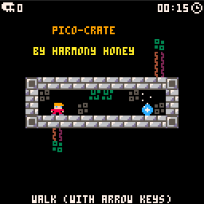
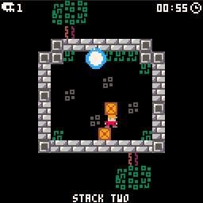
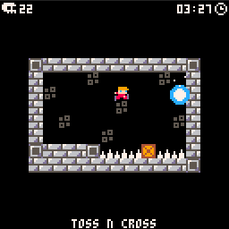
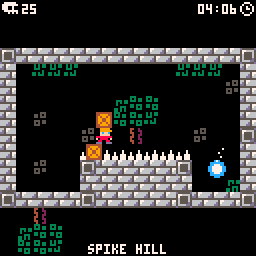
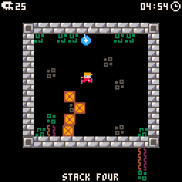
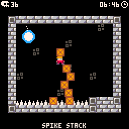
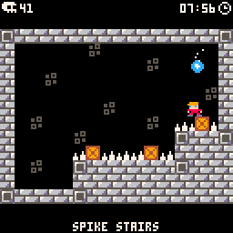
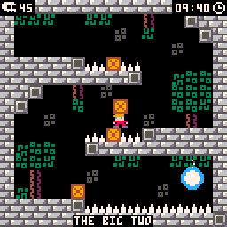

#  PICO-CRATE
Made with [PICO-8](https://www.lexaloffle.com/pico-8.php), [Tiled](https://www.mapeditor.org/) & [Python](https://www.python.org/) !

Crate Chucking Puzzle Platformer 

Play on itch.io [harmonymonroe.itch.io/pico-crate](https://harmonymonroe.itch.io/pico-crate) ! (:

Music from [Pico-8 Tunes Volume 1](https://www.lexaloffle.com/bbs/?tid=29008) by Gruber

## License
See [UNLICENSE](UNLICENSE) or [Unlicense.org](https://unlicense.org/) for more information.

## Screenshots

